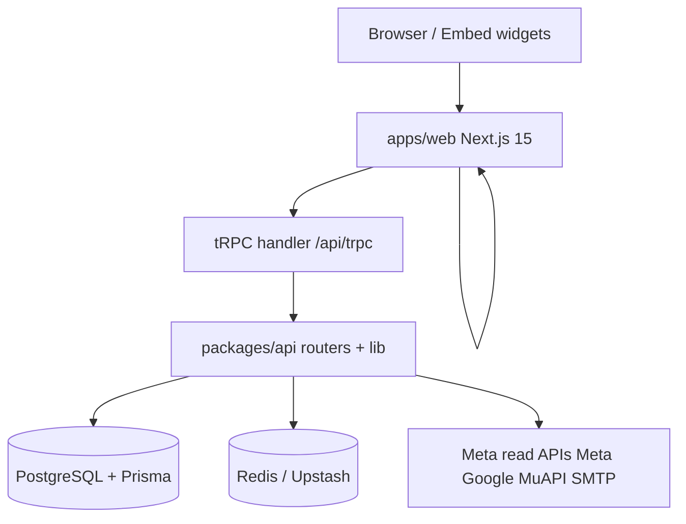

# PROJECT BRAIN — Digitify Lead Search

> **Doel:** Machine-leesbare projectkennis voor LLM’s. Geen marketing; alleen feiten uit de codebase.  
> **Versie:** 1.0.1-alpha · **Package root:** `digitify-lead-search`

---

## 1. Identiteit

| Veld | Waarde |
|------|--------|
| Naam | Digitify Lead Search |
| npm root | `digitify-lead-search` |
| Web app | `@digitify/web` v1.0.1-alpha.0 |
| Doel | Lead generation, scoring, outbound e-mail, CRM, offertes, marketing automation |
| Taal UI | Nederlands (primair) |
| Productie-URL | `https://leads.digitify.be` (docs/VERCEL.md) |
| Branch (CI) | `main`, `master`, `cursor/**` |

---

## 2. Architectuur (high level)

- **Single deployable:** `apps/web` bundelt UI + tRPC + cron + public API routes.
- **Business logic:** grotendeels `packages/api/src/lib/` (niet in page components dupliceren).
- **Shared UI:** `@digitify/ui` (Radix + Tailwind primitives).

---

## 3. Monorepo packages

| Package | Pad | Rol |
|---------|-----|-----|
| `@digitify/web` | `apps/web` | Next.js frontend + API routes |
| `@digitify/api` | `packages/api` | tRPC appRouter, 30 routers, ~93 lib modules |
| `@digitify/db` | `packages/db` | Prisma schema, migraties, seed, RLS helpers |
| `@digitify/ui` | `packages/ui` | Design system components |
| `@digitify/email` | `packages/email` | HTML e-mail shell, safe-url, placeholders |
| `@digitify/scoring` | `packages/scoring` | Lead scoring factors + engine |
| `@digitify/connectors` | `packages/connectors` | Connector utilities (SSRF guard tests) |
| `@digitify/openclaw` | `packages/openclaw` | AI assistant API client |
| `@digitify/media-studio` | `packages/media-studio` | MuAPI model registry + client |

**Workspace config:** `pnpm-workspace.yaml` → `apps/*`, `packages/*`  
**Build orchestration:** `turbo.json` → build, dev, lint, test, db:*

---

## 4. tRPC routers (appRouter)

Gedefinieerd in `packages/api/src/root.ts`:

`dashboard`, `lead`, `campaign`, `tag`, `pipeline`, `settings`, `user`, `contact`, `scoring`, `openclaw`, `search`, `report`, `inbox`, `booking`, `domain`, `review`, `quote`, `chatbot`, `registration`, `crm`, `task`, `invoice`, `audit`, `template`, `social`, `metaAds`, `googleAds`, `media`, `workspace`, `analytics`

**Context:** `packages/api/src/trpc.ts`  
- `protectedProcedure` + `withWorkspace` middleware  
- Rate limiting via `enforceRateLimit`  
- Optional Postgres RLS via `withWorkspaceRls` (`ENABLE_WORKSPACE_RLS`)

---

## 5. Frontend routes (authenticated app)

Base: `apps/web/src/app/(app)/`

| Route | Module | moduleId |
|-------|--------|----------|
| `/dashboard` | Dashboard | — |
| `/leads`, `/leads/search` | Leads | — |
| `/campaigns` | Campagneprofielen | campaigns |
| `/contacts`, `/contacts/inbox`, `/contacts/compose`, `/contacts/approval` | Outbound | contacts |
| `/templates` | Standaard berichten | templates |
| `/crm` | CRM | crm |
| `/tasks` | Taken | tasks |
| `/quotes` | Offertes | quotes |
| `/invoices` | Facturen | invoices |
| `/reports`, `/audit` | Website auditor | reports |
| `/meta-ads` | Meta Ads | metaAds |
| `/google-ads` | Google Ads | googleAds |
| `/social` | Social Planner | social |
| `/creative-studio` | Creative Studio | creativeStudio |
| `/bookings` | Boekingen | bookings |
| `/domains` | Domeinen | domains |
| `/reviews` | Reviews | reviews |
| `/chatbot` | Chatbot | chatbot |
| `/settings/*` | Instellingen | RBAC per path |

Navigatiebron: `apps/web/src/lib/navigation.ts`  
Module guard: `apps/web/src/lib/module-access.ts` + `components/layout/module-access-guard.tsx`

---

## 6. API routes (Next.js, niet-tRPC)

`apps/web/src/app/api/`:

| Pad | Doel |
|-----|------|
| `trpc/[trpc]` | tRPC HTTP handler |
| `auth/[...nextauth]` | NextAuth |
| `health` | Health check |
| `upload`, `upload/client` | Asset uploads (Blob) |
| `cron/drip` | E-mail drip cron |
| `cron/social-publish` | Geplande social posts |
| `cron/bookings-sync` | Boekingen sync |
| `cron/media-reconcile` | Media job reconcile |
| `integrations/meta/*`, `google-ads/*`, `google-calendar/*` | OAuth flows |
| `public/bookings/*` | Publieke boekingswidget |
| `public/quotes/*` | Offerte-portal |
| `public/chatbot/*` | Chatbot widget API |
| `public/tracker` | Website tracker |
| `public/reviews/*` | Review embed |
| `public/email/open/[id]` | E-mail open tracking |
| `muapi/[...path]` | MuAPI proxy (BYOK) |
| `quotes/*/pdf`, `invoices/*/pdf`, `leads/export/pdf` | PDF export |

Cron auth: `packages/api/src/lib/cron-auth.ts` (`CRON_SECRET`).

---

## 7. Database (Prisma)

**Schema:** `packages/db/prisma/schema.prisma`  
**Migraties:** `packages/db/prisma/migrations/` (33 SQL folders)  
**Seed:** `packages/db/prisma/seed.ts` (vereist `SEED_ADMIN_EMAIL`, `SEED_ADMIN_PASSWORD`)

### Belangrijkste modellen

**Auth/tenant:** `User`, `Workspace`, `WorkspaceMembership`, `RegistrationRequest`, `Setting`  
**Leads:** `Lead`, `LeadContact`, `Tag`, `PipelineStage`, `ScoringWeight`, `LeadScoringFactor`, `EnrichmentData`  
**Outbound:** `EmailTemplate`, `EmailDraft`, `Campaign`, `CampaignLead`  
**Sales:** `Quote`, `WorkspaceInvoice`, `WorkspaceTask`, `WorkspaceSavedSearch`  
**Marketing:** `SocialPost`, `MetaAdAccount`, `MetaAdPlan`, `GoogleAdAccount`, `GoogleAdPlan`, `MediaGeneration`  
**Tools:** `Booking*`, `Domain`, `ReviewRequest`, `ChatSession`, `Report`, `OpenClawLog`  
**Analytics:** `WorkspaceAnalyticsEvent`, `BookingAnalyticsEvent`

**Dode/legacy:** `SavedView` (TODO: opruimen — docs/PHASES.md 9.1)

### Tenant model (kritiek)

- `workspaceId` in app context = **owner `users.id`**
- Rijen: `createdById = workspaceId`
- RLS: `packages/db/src/workspace-rls.ts`, migratie `20260522160000_workspace_row_level_security`
- Settings keys: `workspace:{workspaceId}:{key}` (shared) vs `user:{memberId}:{key}` (personal)

---

## 8. Auth & security

| Onderdeel | Locatie |
|-----------|---------|
| NextAuth options | `apps/web/src/lib/auth/options.ts` |
| Session helpers | `apps/web/src/lib/auth/session.ts` |
| API permissions | `packages/api/src/lib/permissions.ts` |
| Web permissions | `apps/web/src/lib/permissions.ts` |
| Effective workspace role | `packages/api/src/lib/effective-role.ts` |
| Env validation | `packages/api/src/lib/server-env.ts` |
| Rate limits | `rate-limit.ts`, `rate-limit-redis.ts`, `rate-limit-upstash.ts` |
| Public tenant token | `packages/api/src/lib/public-tenant.ts` |
| SSRF guard | `packages/connectors/src/` |

**Productie vereist:** `ENABLE_WORKSPACE_RLS=true`, `SETTINGS_ENCRYPTION_KEY`, `CRON_SECRET`, sterke `NEXTAUTH_SECRET`.

---

## 9. Integraties

| Integratie | Config / code |
|------------|---------------|
| Google Places (lead search) | settings + `google-places.ts` |
| Meta (Social + Ads) | `social-meta.ts`, `meta-ads.ts`, OAuth routes |
| Google Ads | `google-ads.ts`, `google-ads-oauth.ts` |
| Google Calendar | `google-calendar.ts` |
| MuAPI / Creative Studio | `media-studio`, `muapi-key.ts`, `media.router.ts` |
| SMTP/IMAP | `email-sender.ts`, workspace settings |
| Vercel Blob | `BLOB_READ_WRITE_TOKEN`, `import-media-to-blob.ts` |
| Sentry | `@sentry/nextjs`, `packages/api/src/lib/sentry.ts` |
| OpenClaw AI | `@digitify/openclaw`, `openclaw.router.ts` |

---

## 10. Teststructuur

| Type | Locatie | Commando |
|------|---------|----------|
| API unit | `packages/api/src/__tests__/*.test.ts` | `pnpm --filter @digitify/api test` |
| Email | `packages/email/src/__tests__/` | turbo |
| Scoring | `packages/scoring/src/__tests__/` | turbo |
| UI | `packages/ui/src/__tests__/` | turbo |
| Web unit | `apps/web/src/lib/__tests__/` | `pnpm --filter @digitify/web test` |
| Integration (DB) | `*.integration.test.ts` | `pnpm test:integration` |
| E2E | `apps/web/e2e/*.spec.ts` | `pnpm test:e2e` |
| RLS smoke | `packages/db/prisma/rls-staging-smoke.ts` | `pnpm rls:smoke` |

CI: `.github/workflows/ci.yml` — test, typecheck, lint, build, migrate, e2e job.

---

## 11. Dev & deploy scripts

| Script | Pad |
|--------|-----|
| Dev met env | `scripts/dev-with-env.sh` |
| Migrate deploy | `scripts/prisma-migrate-deploy.sh` |
| Productie DB setup | `scripts/setup-production-db.sh` |
| Release check | `scripts/check-release.sh` |
| Init migration fix | `scripts/resolve-init-migration.sh` |

Docker: `docker-compose.yml` — Postgres 16 (`digitify_leads`) + Redis 7.

---

## 12. Feature flags / modules

Toggle per user via `modules.disabled` setting (Team & Rollen).  
Volledige lijst: `ALL_MODULES` in `navigation.ts` (16 modules).

Leads + dashboard zijn **altijd** beschikbaar (geen moduleId).

---

## 13. Bekende risico’s & schuld

Bron: `docs/PHASES.md`

- Productie live + RLS op staging/productie: **open** (handmatig)
- Geen `.env.example` in repo
                        → TODO: bevestigen
- `settings/quotes/page.tsx` ~5000 regels               → refactor gepland (fase 10)
- Runtime JSON migraties op list endpoints               → fase 9.2
- `SavedView` model unused                             → fase 9.1

---

## 14. LLM workflow checklist

Bij elke taak:

1. Lees `MODULE_MAP.md` voor de betreffende feature
2. Zoek router + `lib/` helper vóór UI-only fixes
3. Check tenant scope (`workspaceId`, `createdById`, RLS)
4. Run relevante tests (minimaal `pnpm test` packages)
5. Update `AI_CHANGELOG.md` na merge-worthy wijziging
6. **Commit niet** tenzij user vraagt

---

## 15. Gerelateerde docs

- [PROJECT_WIKI.md](./PROJECT_WIKI.md) — uitgebreide wiki
- [MODULE_MAP.md](./MODULE_MAP.md)
- [FILE_INDEX.md](./FILE_INDEX.md)
- [DECISIONS.md](./DECISIONS.md)
- [TODO.md](./TODO.md)
- [AI_CHANGELOG.md](./AI_CHANGELOG.md)
- [PHASES.md](./PHASES.md)
